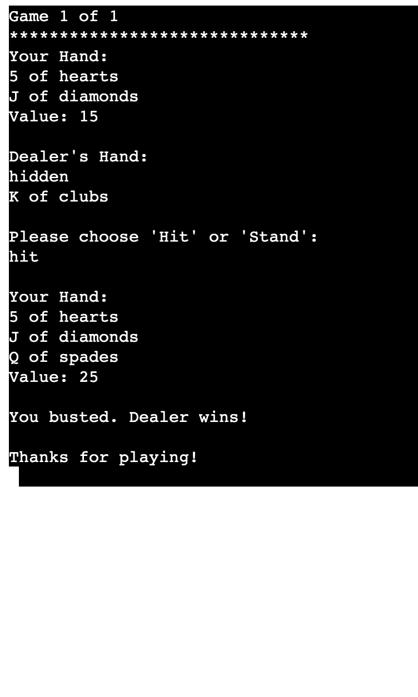
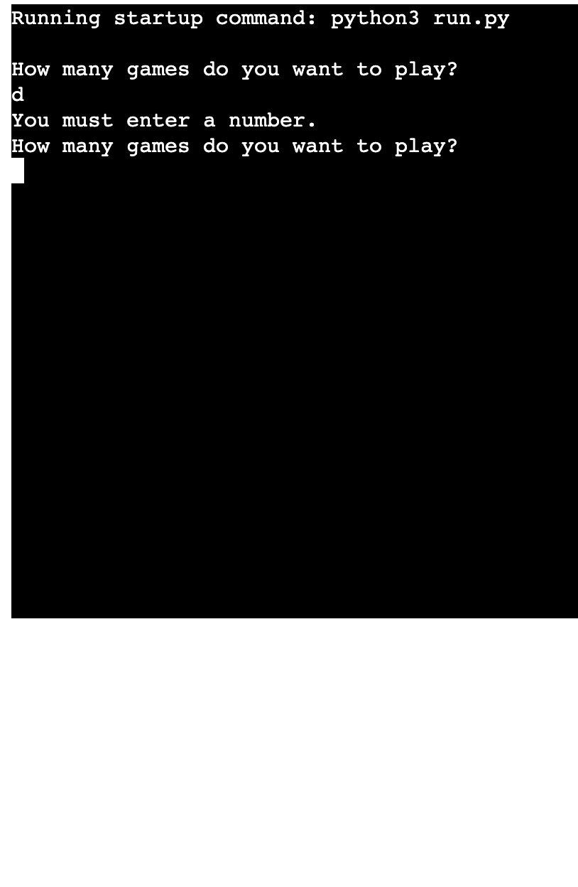
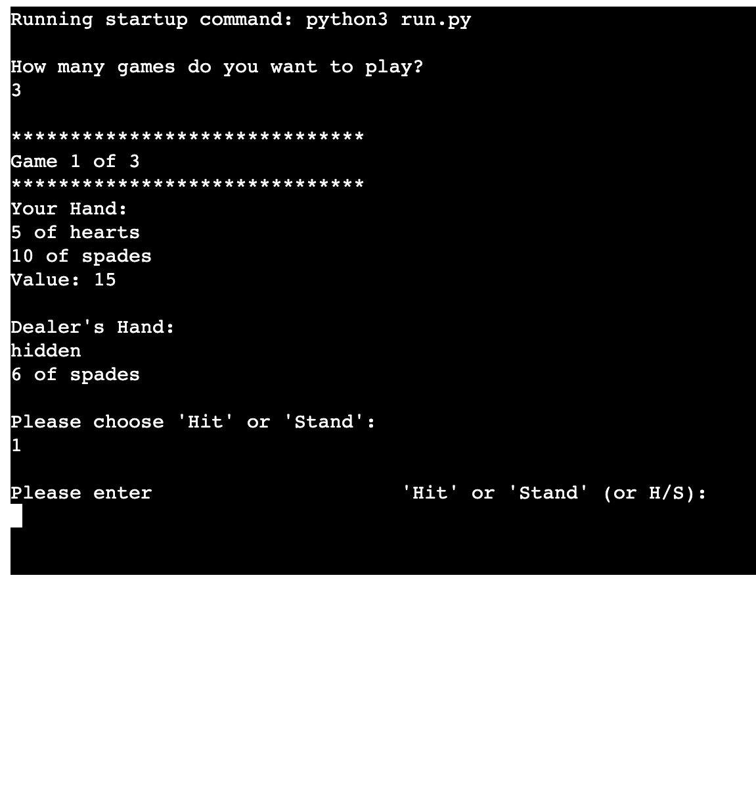

# **BlackJack**

#### Blackjack, also known as 21 is one of the most popular casino card games in Las Vegas. The rules on playing blackjack in Vegas are quite simple, which is a major reason for the game's enduring popularity.
In Las Vegas casinos, blackjack is played on a semi-circular table, with the round portion of the table facing the players, and the straight edge side facing the dealer.

 

 

 

## How to play

 

#### Players make their bets.
Players are dealt 2 cards.
Dealer is dealt 2 cards where the second card is hidden from the players.
The objective of the game is to have a higher point total than the dealer (but no more than 21, anything over 21 is an automatic loss called a bust) — if you beat the dealer in this way, you win from the casino what you bet (you also win if the dealer busts). Aces can be worth either 1 or 11; every other card is worth its face amount (face cards are worth 10).
An initial 2 card hand composed of an ace and a face card is called a blackjack and is the best possible hand.
After the first round of dealing, each player has the option to hit (receive more cards) or stay (no more cards). If hitting results in the player busting (total going over 21), then his or her bet is lost.
After all the players are done hitting/staying, the dealer flips over his hidden card. If the dealer’s total is less than 17, then he or she needs to hit (receive a new card). This process repeats until the dealer’s hand either totals to 17 or more or busts (goes above 21).
After the dealer is done, the final results are decided — if the dealer busts, then any player who did not bust earlier wins his or her bet. If the dealer does not bust, then the dealer’s total is compared to each player’s. For any player whose total is greater than the dealer’s, he or she wins money (in the amount that was bet). For any player whose total is less than the dealer’s, he or she loses money. No money is exchanged in the event of a tie.

 

- - -

# Features

 

## Existing Features

* Random card generation
* Cards are randomly genereted on both the player and the computer sites.
* The player cannot see the computers deck only one card.

 

* Play against the computer
* Accepts user inputs

* Input validation and error-checking
* You cannot enter letters
* You must enter numbers

* You cannot enter numbers or only letter
* You cann enter only hit or stand

 

# Data Model

#### I use Card class,Hand class, Deck class  whith methods such as shuffle to shuffle the cards, Shuffle the deck
Ask the Player for their bet
Make sure that the Player’s bet does not exceed their available chips
Deal two cards to the Dealer and two cards to the Player
Show only one of the Dealer’s cards, the other remains hidden
Show both of the Player’s cards
Ask the Player if they wish to Hit, and take another card
If the Player’s hand doesn’t Bust (go over 21) , ask if they’d like to Hit again

### Features Left to Implement
- When there is time, i would include score or a timer when the game is over.

 

## Technologies Used

### Languages Used

Python.

### Frameworks, Libraries & Programs Used

codeanywhere - For version control.

Github - To save and store the files for the website.

Random librarie

[Am I Responsive?](http://ami.responsivedesign.is/) To show the website image on a range of devices.

 

## Deployment & Local Development

### Deployment

This project was deployed using Code Institute's mock terminal for Heroku. The instructions to achieve this are below:

1. Fork or clone this repository.
2. Create a new Heroku app.
3. Set the buildpacks to Python and NodeJS in that order.
4. Link the Heroku app to the repository.
5. Click on Deploy.

### Local Development

#### How to Fork

To fork the BlackJack repository:

1. Log in (or sign up) to Github.
2. Go to the repository for this project, JohannHelbert/Rock-Paper-Scissors.
3. Click the Fork button in the top right corner.

#### How to Clone

To clone the BlackJack repository:

1. Log in (or sign up) to GitHub.
2. Go to the repository for this project, JohannHelbert/BlackJack.
3. Click on the code button, select whether you would like to clone with HTTPS, SSH or GitHub CLI and copy the link shown.
4. Open the terminal in your code editor and change the current working directory to the location you want to use for the cloned directory.
5. Type 'git clone' into the terminal and then paste the link you copied in step 3. Press enter.

# Testing

### Full Testing

Full testing was performed on the following devices:

* Laptop:
  * Macbook Pro 2015 13 inch screen
* Mobile Devices:
  * iPhone 12 pro.
  * google pixel 5.

Each device tested the site using the following browsers:

* Google Chrome
* Safari
* Firefox

| Feature | Expected Outcome | Testing Performed | Result | Pass/Fail |
| --- | --- | --- | --- | --- |
|  |  |  |  |  |
| Hit or stand function | choose hit or stand?. | type choose | working. | Pass |
|  |  |  |  |  |
| Amount of games | How many games you will play?. | typing  | working. | Pass |
|   |   |   |   |
| Game function | The Game working well? | Type | all functions working | Pass |

* Passed the code through a PEP8 linter and confirmed there are no problems
* Given invalid inputs: strings when numbers are expected
* Tested in my local terminal and the Heroku Terminal  

 

### Bugs/issues

 

- There was whitespace between the functions.
- Removing the space and fixed the problem
- There was blankline error
- Add line and fix the problem
- Some code was too long
- add \ and place rest of the code one line under the code fix the problem

 

## Validator Testing 

 

- No errors were returned when passing through the official PEP8 validator

 

# Credits

* Code Institute for the deployment terminal
* For the rules i use text from this site https://towardsdatascience.com/lets-play-blackjack-with-python-913ec66c732f
* I use a tutorial how to build this game from this video https://www.youtube.com/watch?v=eWRfhZUzrAc
